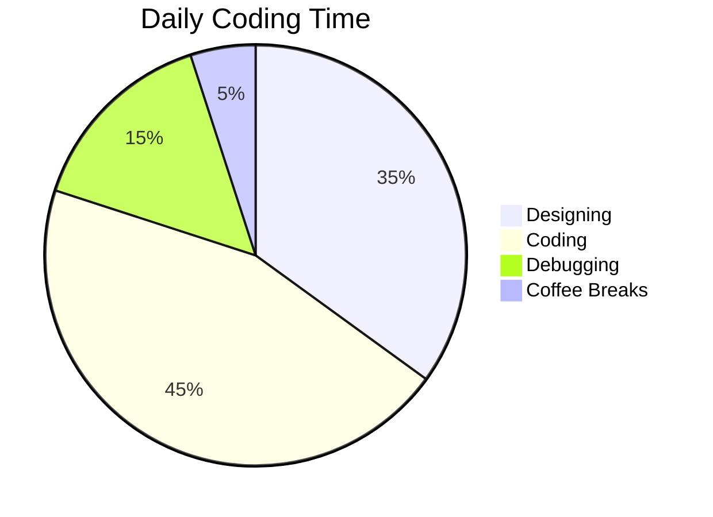

<!---
IamAdedo/IamAdedo is a ✨ special ✨ repository because its `README.md` (this file) appears on your GitHub profile.
You can click the Preview link to take a look at your changes.
--->

<!-- Animated Banner -->
<div align="center">

</div>

<!-- Title with Animated Typing -->
<h1 align="center">
  
</h1>


## Hi there, 𝙸𝚊𝚖𝙰𝚍𝚎𝚍𝚘 𓆩☬𓆪, *ㄒ卄乇 ㄥ卂乙ㄚ 卄凵几ㄒ乇尺*

```markdown
𝙸𝚊𝚖𝙰𝚍𝚎𝚍𝚘 𓆩☬𓆪, ㄒ卄乇 ㄥ卂乙ㄚ 卄凵几ㄒ乇尺
```
Tech enthusiast...a dynamic professional skilled in digital design and software development, adept at merging creativity with technical prowess to craft cutting-edge digital experiences.
an hobbyist video editor & Photographer.

<div align="center" style="border: 1px solid grey">
  
</div>

---

## 🔮 **About Me**
🎨 **Digital Artisan** blending design magic with code sorcery  
💻 **Full-Stack Explorer** crafting immersive digital experiences  
📸 **Visual Storyteller** through lens and video timelines  
☕ **Caffeine-powered** problem solver  


```javascript
const lazyHunter = {
  pronouns: "he/him",
  hobbies: ["Photography", "Gaming", "Anime"],
  motto: "Build fast, break things, learn faster"
};

const mySkills = {
  design: ["UI/UX", "Photoshop", "Illustrator", "Figma"],
  code: ["JavaScript", "Python", "React", "Node.js", "HTML/CSS"],
  tools: ["React", "Node", "Figma", "Adobe Suite"],
  architecture: ["MERN Stack", "Serverless"],
  creative: ["Photography", "Video Editing", "Motion Graphics"],
  philosophy: "Create first, optimize later"
};
```

---

## 🌐 **Connect With Me**
<div align="center">


[](https://t.me/IamAdedo) [](https://x.com/IamAdedo) [](https://linkedin.com/in/IamAdedo) [](https://about.me/IamAdedo) [](mailto:noreplyadedo@gmail.com)

</div>

<details>
<summary><b>📌 All My Links</b></summary>
  
### **Social**
[](https://m.me/IamAdedo)
[](https://instagram.com/IamAdedo)
  
### **Creative**
[](https://behance.net/IamAdedo)
[](https://dribbble.com/IamAdedo)

### **Code**
[](https://github.com/IamAdedo)
[](https://codepen.io/IamAdedo)
</details>

---

## 🛠️ **Current Tech Stack**


---

## 📊 **GitHub Stats**
<div align="center">
  

  


</div>

---

<div align="center">
  

  
</div>


<!-- Animated Banner -->
<div align="center">
  
</div>

<!-- Title with Animated Typing -->
<h1 align="center">
  
</h1>

<!-- Social Badges with Hover Effects -->
<div align="center">
  
[](https://linktr.ee/IamAdedo)
[](https://t.me/IamAdedo)
[](mailto:adedo@example.com)

</div>

<!-- Animated Divider -->


<!-- About Me Section with Flip Card Effect -->
<details>
<summary><h2>🎭 <b>About The Hunter</b></h2></summary>
  
```javascript
const lazyHunter = {
  pronouns: "he/him",
  hobbies: ["Photography", "Gaming", "Anime"],
  motto: "Build fast, break things, learn faster"
};

const mySkills = {
  design: ["UI/UX", "Photoshop", "Illustrator", "Figma"],
  code: ["JavaScript", "Python", "React", "Node.js", "HTML/CSS"],
  tools: ["React", "Node", "Figma", "Adobe Suite"],
  architecture: ["MERN Stack", "Serverless"],
  creative: ["Photography", "Video Editing", "Motion Graphics"],
  philosophy: "Create first, optimize later"
};
```

```javascript
const mySkills = {
  design: ["UI/UX", "Photoshop", "Illustrator", "Figma"],
  code: ["JavaScript", "Python", "React", "Node.js"],
  creative: ["Photography", "Video Editing", "Motion Graphics"],
  philosophy: "Create first, optimize later"
};
```


<div align="center">
  
</div>
</details>

<!-- Tech Stack with Animated Icons -->
<h2 align="center">⚔️ <b>Hunter's Toolkit</b></h2>

<div align="center">
  
| Category        | Tools                                                                 |
|-----------------|-----------------------------------------------------------------------|
| **Frontend**    |    |
| **Backend**     |    |
| **Design**      |    |
| **Other**       |    |

</div>

<!-- GitHub Stats with 3D Effect -->
<h2 align="center">📊 <b>GitHub War Stats</b></h2>

<div align="center">
  
[](https://git.io/streak-stats)

[](https://github.com/ryo-ma/github-profile-trophy)

</div>

<!-- Featured Projects -->
<h2 align="center">🏆 <b>Notable Hunts</b></h2>

<div align="center">
  
| Project | Description | Tech Stack |
|---------|-------------|------------|
| **NXVX ehshop (https://)** | AI-powered design assistant |   |
| **[Project 2](link)** | Interactive portfolio builder |   |

</div>

<!-- Daily Coding Habit -->
<h2 align="center">⏳ <b>Daily Coding Ritual</b></h2>



<!-- Footer with Animated GIF -->
<div align="center">
  
  <p>Made with ❤️ and too much coffee</p>
</div>
