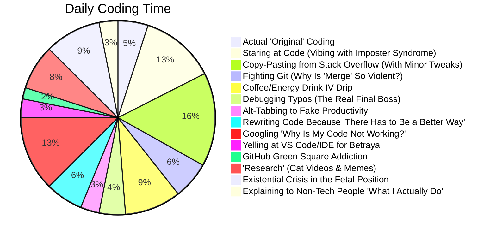

<!---
IamAdedo/IamAdedo is a ✨ special ✨ repository because its `README.md` (this file) appears on your GitHub profile.
--->

<!-- Dynamic Animated Header with Time-Based Greeting -->
<div align="center">
  
  
```markdown
𝙸𝚊𝚖𝙰𝚍𝚎𝚍𝚘 𓆩☬𓆪, ㄒ卄乇 ㄥ卂乙ㄚ 卄凵几ㄒ乇尺
```
 </div>

<!-- 3D Social Links with Interactive Hover -->
<div align="center" style="margin: 20px 0;">
  <a href="https://t.me/IamAdedo" target="_blank">
    
  </a>
  <a href="https://x.com/IamAdedo" target="_blank">
    
  </a>
  <a href="https://linkedin.com/in/IamAdedo" target="_blank">
    
  </a>
  <a href="https://linktr.ee/IamAdedo" target="_blank">
    
  </a>
</div>

<!-- Interactive Tabs Navigation -->
<div align="center">
  <a href="#about">About</a> ••
  <a href="#skills">Skills</a> ••
  <a href="#stats">Stats</a> ••
  <a href="#projects">Projects</a> ••
  <a href="#contact">Contact</a>
</div>

<br>

<div align="center">
  
  


              

</div>

---

<!-- About Section with 3D Card Effect -->
<h2 id="about" align="center">🎯 <b>About Me</b></h2>

<div align="center" style="border-radius: 50%;">
  
</div>

<br>

🎨 **Digital Artisan/Sorcerer** blending design magic with code sorcery by conjuring pixels into purpose.
💻 **Full-Stack Explorer** crafting immersive digital experiences with a side of AI wizardry.  
📸 **Visual Storyteller** through lens and video timelines with a camera roll full of chaos. 

<br>

```javascript
const IamAdedo = {
  aliases: ["The Lazy Hunter", "dLazyHunter", "TheHobbyist", "The Hobbyist"],
  devMode: true,
  pronouns: "he/him",
  hobbies: ["Gaming 🎮", "Photography 📷", "Anime 🔥", "Overthinking things I already built"],
  motto: "Build fast, break things, learn faster, Ship it, Then polish it."
};

const mySkills = {
  design: ["UI/UX", "Photoshop", "Illustrator", "Figma"],
  code: ["JavaScript", "Python", "React", "Node.js", "HTML/CSS"],
  tools: ["React", "Node", "Figma", "Adobe Suite", "Git", "VS Code", "Google", "Prayer", "ChatGPT"],
  architecture: ["MERN Stack", "Serverless"],
  creative: ["Photography", "Video Editing", "Motion Graphics"],
  philosophy: "Create first, optimize later & If it's stupid but it works, it's not stupid." };
```


<div align="center" style="border: 1px solid grey">
  
</div>

---

## 🌐 **Connect With Me**
<div align="center">


[](https://t.me/IamAdedo) [](https://x.com/IamAdedo) [](https://linkedin.com/in/IamAdedo) [](https://about.me/IamAdedo) [](mailto:noreplyadedo@gmail.com) 
[](https://about.me/IamAdedo)  

**Or just send me a meme. I accept payment in GIFs.** 😆  

</div>

<details>
<summary><b>📌 All My Links</b></summary>
  
### **Social**
[](https://m.me/IamAdedo)
[](https://instagram.com/IamAdedo)
  
### **Creative**
[](https://behance.net/IamAdedo)
[](https://dribbble.com/IamAdedo)

### **Code**
[](https://github.com/IamAdedo)
[](https://codepen.io/IamAdedo)
</details>
<br>

---

<!-- Tech Stack with Animated Icons -->
<h2 align="center">⚔️ <b>Hunter's Toolkit</b></h2>

<div align="center">
  
| Category        | Tools                                                                 |
|-----------------|-----------------------------------------------------------------------|
| **Frontend**    |    |
| **Backend**     |    |
| **Design**      |    |
| **Other**       |    |

</div>
<br>

---

<!-- GitHub Stats with 3D Effect -->
<h2 align="center">📊 <b>GitHub War Stats</b></h2>

<div align="center">
  

  
[](https://git.io/streak-stats)

[](https://github.com/ryo-ma/github-profile-trophy)


</div>
<br />

---

<!-- Featured Projects -->
<h2 align="center">🏆 <b>Notable Hunts</b></h2>

<div align="center">
  
| Project | Description | Tech Stack |
|---------|-------------|------------|
| **[NXVX e-shop](https://vercel.app)** | AI-powered design assistant |   |
| **[Project 2](link)** | Interactive portfolio builder |   |

</div>
<br>

---

<!-- Daily Coding Habit -->
<h2 align="center">⏳ <b>Daily Coding Ritual: A Beautiful Disaster</b></h2>



<!-- Footer with Animated GIF -->
<div align="center">
  <p>Made with ❤️ and too much coffee by IamAdedo</p>


1
  

 
<br>
2


3


4


</div>
